# 🛒 Supermarket Scraper Tunisie

**Professional web scraping tool for Tunisian supermarkets**

```mermaid
flowchart TD
    A[🎨 PySide6 GUI] --> B[⚙️ Scraping Controller]
    B --> C[🔧 Multi-Site Engine]
    C --> D[🛡️ Selenium WebDriver]
    D --> E[🌐 Websites]
    C --> F[📊 Data Processor]
    F --> G[💾 CSV/Excel/JSON]
    F --> H[📈 Results Dashboard]
    
    style A fill:#3498db,color:white
    style B fill:#2ecc71,color:white
    style C fill:#e74c3c,color:white
    style D fill:#f39c12,color:white
    style F fill:#9b59b6,color:white
    style G fill:#1abc9c,color:white
    style H fill:#34495e,color:white
```

<div align="center">



</div>

## 🏗️ Architecture Overview

### 🔷 **Frontend Layer** (`#3498db`)
- **PySide6 GUI** with real-time monitoring
- Live logs & progress tracking
- Interactive results table
- Export management interface

### 🟢 **Control Layer** (`#2ecc71`)
- Multi-threaded scraping engine
- Category management system
- Configuration controller
- Error handling & recovery

### 🔴 **Scraping Layer** (`#e74c3c`)
- **Adaptive element detection**
- Multi-strategy pattern matching
- Dynamic content loading
- Anti-bot evasion techniques

### 🟠 **Driver Layer** (`#f39c12`)
- **Selenium WebDriver** management
- Chrome/Chromium automation
- Headless mode support
- Session management

### 🟣 **Processing Layer** (`#9b59b6`)
- Data validation & cleaning
- Price normalization
- Image URL processing
- Timestamp management

### 🔶 **Export Layer** (`#f39c12`)
- **CSV** with UTF-8 encoding
- **Excel** with formatting
- **JSON** for APIs
- Organized file structure

### ⚫ **Storage Layer** (`#34495e`)
- Timestamped result folders
- Debug screenshots
- Configuration backups
- Log archives

## 🛠 Tech Stack


## ⚡ Quick Start

```bash
# Clone & install
git clone <repo>
pip install -r requirements.txt

# Run
python main.py
```

**📦 Dependencies:** `PySide6`, `Selenium`, `Pandas`, `WebDriver-Manager`

**📄 License:** MIT  
**🐛 Issues:** GitHub Issues  
**⭐ Support:** Give us a star!

---

<div align="center">
  <sub>Built with ❤️ for Tunisia's digital ecosystem</sub>
</div>
